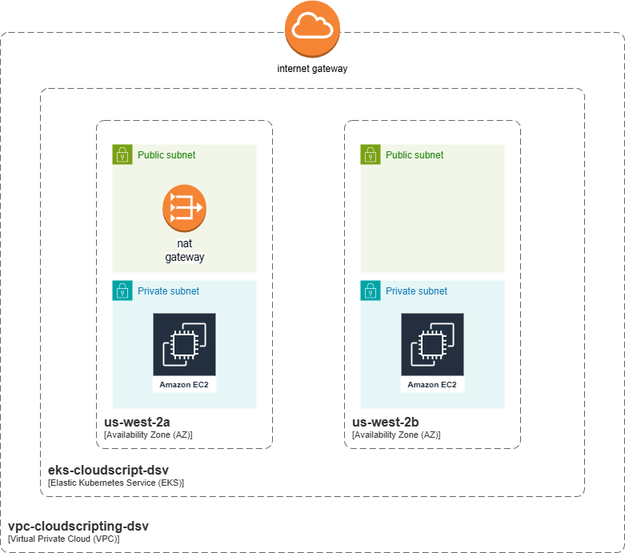
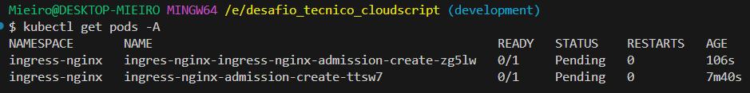

# CloudScript Technology DevOps Challenge

Trata-se de um projeto de IaC para implantação de EKS e VPC funcionais. Os detalhes do projeto podem ser conferidos em [challenge.md](./challenge.md).

## Visão geral da solução

O presente projeto busca implementar um Elastic Kubernetes Service (EKS) em uma dada rede Virtual Private Cloud (VPC), ambos fazendo uso de infraestrutura como código (IaC), Terraform. Para tal, foi adotada uma abordagem em módulos em que é feito o consumo somente do necessário. Também foram avaliadas questões de custo para região e size das `EC2` que compôem os node groups do EKS. Também foi necessário configurar um usuário associado a _roles_ e _policies_ IAM, de forma a não usar o perfil _root_ e estar em conformidade com a política de acesso estritamente necessário apenas.

## Explicação da arquitetura

A arquitetura proposta utiliza serviços gerenciados da Amazon Web Services e é provisionada integralmente via Terraform, seguindo princípios de infraestrutura como código, segurança por padrão e otimização de custos.

A base da solução é uma Virtual Private Cloud (VPC) dedicada, responsável por isolar e segmentar os recursos de rede. Dentro dessa VPC são criadas subnets privadas, nas quais residem os `nodes` do `cluster` Kubernetes, garantindo que as cargas de trabalho não fiquem diretamente expostas à internet.

Sobre essa VPC é implantado um `cluster` Amazon Elastic Kubernetes Service (EKS), responsável pelo plano de controle do Kubernetes. O Control Plane é gerenciado pela AWS (`managed`), reduzindo o esforço operacional e aumentando a confiabilidade da solução. Para fins de operação e simplicidade no desafio, o `endpoint` da API do Kubernetes é configurado como público, permitindo o uso do kubectl a partir da máquina local.

Os `node groups` gerenciados do EKS utilizam instâncias `EC2` com `AMI` `Amazon Linux 2023`, em modo `ON_DEMAND`, equilibrando compatibilidade, custo e previsibilidade. Esses `nodes` são criados exclusivamente em subnets privadas, reforçando o isolamento das aplicações.

O acesso externo às aplicações executadas no `cluster` não depende do endpoint do EKS, mas sim de recursos Kubernetes como Services do tipo LoadBalancer ou Ingress, que, quando configurados, provisionam automaticamente balanceadores de carga gerenciados pela AWS.

O controle de acesso à infraestrutura é realizado via IAM, utilizando roles e policies específicas, evitando o uso do usuário root e aplicando o princípio do menor privilégio.

O diagrama `c4` correspondente à arquitetura da solução pode ser observado na Figura a seguir:



## Execução do Terraform

Deve-se fazer a instalação do Terraform na máquina e adicioná-lo às variáveis de ambiente `PATH`. Feito isso, pode-se conferir após o _reboot_ que o comando abaixo reconhece o cmdlet `terraform`:

```sh
terraform -v
Terraform v1.14.3
on windows_386
+ provider registry.terraform.io/hashicorp/aws v6.28.0
+ provider registry.terraform.io/hashicorp/cloudinit v2.3.7
+ provider registry.terraform.io/hashicorp/null v3.2.4
+ provider registry.terraform.io/hashicorp/time v0.13.1
+ provider registry.terraform.io/hashicorp/tls v4.1.0
```

Após isso, pode-se fazer uma cópia do arquivo [values](./values.tfvars.example) de exemplo, removendo a extensão `.example`, ficando portanto `values.tfvars`. De posse do arquivo de valores, deve-se inserir seus próprios valores e salvá-lo.

### Criando State e Baixando Módulos

Para iniciar a provisão, execute o comando de init abaixo:

```sh
terraform init
```

Dessa forma, os módulos remotos serão baixados e o arquivo de `state` será criado no `backend`. Sobre esse último componente, optou-se pela abordagem local, para não ter de criar um Bucket S3 e arcar com eventuais custos. No entanto, é uma boa prática utilizar `remote state`, o que pode ser alcançado com o seguinte _snippet_ ([fonte](https://developer.hashicorp.com/terraform/language/backend/s3)):

```tf
terraform {
  backend "s3" {
    bucket = "mybucket"
    key    = "path/to/my/key"
    region = "us-east-1"
  }
}
```

### Executando Plan e Dependências

Antes de executar o `terraform apply`, por mais que ele já faça um `plan`, é boa prática verificar as mudanças na infraestrutura com o terraform plan. Como estamos usando um arquivo `.tfvars`, deve-se utilizar o argumento `var-file` para especificar nosso arquivo. Para esse caso, utilizei também a opção `-out` para exportar o plan como arquivo `.tfplan`. O comando descrito está disposto no _snippet_ a seguir:

```sh
terraform plan -var-file="./values.tvars" -out="plan.tfplan"
```

Esse arquivo pode ser tranformado em texto (`.txt`) para leitura posterior utilizando o comando abaixo:

```sh
terraform show -no-color plan.tfplan
```

Agora sobre as dependências, temos que o módulo `EKS` precisa da resolução de valores oriundos da `VPC`, então deve-se provisioná-lo após a criação desse recurso. Por estarmos usando módulos não há diretiva `depends_on`, o que é um problema. Nesse cenário, pode-se executar o `plan` ou `apply` utilizando o argumento `target` ou fazer o `enforce` com os valores de `output` do módulo `VPC`. Dessa forma, sem o uso do target, o plan ficaria assim:

```sh
terraform plan -var-file="values.tfvars" -out="plan.tfplan"
```

Depois disso, o arquivo `.tfplan` pode ser usado no apply.

### Apply

Para executar o apply, basta passar ou os valores do `.tfvars` em `var-file` ou um arquivo `.tfplan`. Optei pela segunda opção, chegando ao comando:

```sh
terraform apply plan.tfplan
```

### Destroy

Após uso da infraestrutura, quando não se faz mais necessária, eu rodo o `destroy`, apontando para o arquivo de `.tfvars` como indicado no _snippet_ abaixo:

```sh
terraform destroy -var-file="values.tfvars"
```

### Tflint

Também fiz uso do tflint para verificar algum problema de identação ou boa prática utilizando o comando de mesmo nome `tflint`. Antes dele, usei `terraform fmt` para formatar os arquivos na raiz, que foram os que eu criei. Para casos de `nesting`, pode-se usar a opção `-recurse`.

## Dentro do Cluster

Ao finalizar a provisão, conforme `enable_cluster_creator_admin_permissions` que foi dado como `true`, pode-se acessar o kubernetes utilizando o `kubectl`, como exemplo abaixo:



Só que é necessário fazer o update to contexto `kubeconfig` utilizando nossa conta de administrador, a mesma que provisionou o recurso.

```sh
aws eks update-kubeconfig   --name eks-cloudscript-dsv   --region us-west-2   --profile eks-admin
```

## Decisões técnicas

- Uso dos módulos `VPC` e `EKS` para provisão da infraestrutura;
- Controle de arquivos sensíveis usando o `.gitignore`;
- Adoção de node group `AL2023_x86_64_STANDARD `, com capacidade `ON_DEMAND` para otimização dos custos;
- Uso do `terraform destroy` ao final do laboratório para exclusão da infraestrutura;
- Acesso ao `endpoint` kubernetes público, para uso do `kubectl` na máquina local;
-

## Melhorias Identificadas

- Granularidade de acesso utilizando IAM `roles` para provisão, acesso e exclusão da infraestrutura;
- Segurança do Kubernetes, tornando sua API privada e fazendo acesso por `VPN` ou `Bastion`.
